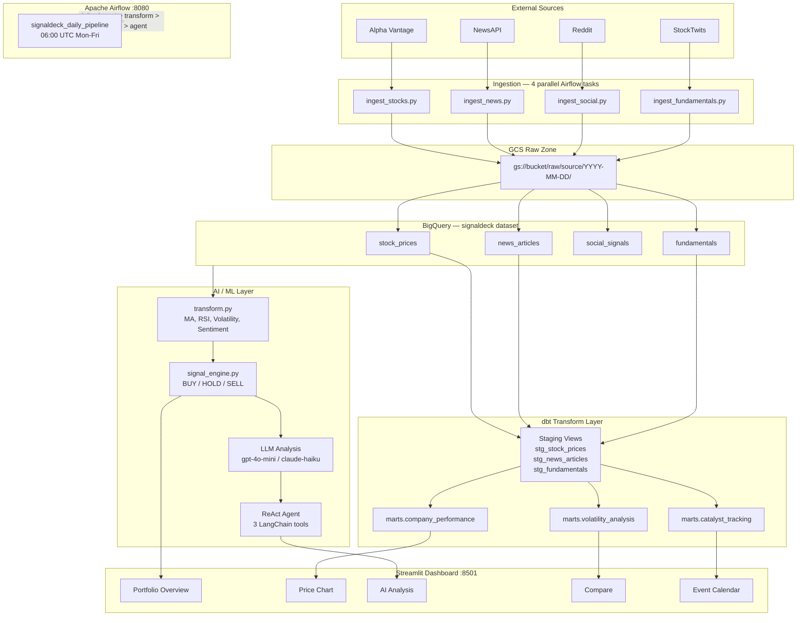

# SignalDeck AI

> Production-grade market intelligence platform that ingests multi-source financial data into BigQuery via a GCS raw zone, builds curated dbt mart models, runs LLM + ReAct agent analysis, and surfaces everything through an interactive Streamlit dashboard — orchestrated end-to-end with Apache Airflow.

[](https://www.python.org/)
[](https://airflow.apache.org/)
[](https://docs.getdbt.com/)
[](https://cloud.google.com/bigquery)
[](https://langchain.com/)
[](https://streamlit.io/)
[](#testing)

---

## What This Project Demonstrates

| Area | Skills |
|------|--------|
| **Data Engineering** | Multi-source parallel ingestion, GCS raw staging, BigQuery time-partitioned + clustered tables, dbt staging views + mart tables, Airflow DAG with XCom |
| **Analytics Engineering** | dbt models for company performance, volatility regime, and catalyst tracking — with schema tests on every business-logic column |
| **Cloud / GCP** | BigQuery dataset design, TIME_PARTITIONING, CLUSTER BY, named query parameters, GCS NDJSON archive |
| **AI / LLM Engineering** | Structured prompt design, enum-validated JSON output, OpenAI + Anthropic support, LangChain ReAct agent with 3 custom tools |
| **Software Engineering** | Adapter pattern (SQLite dev / BigQuery prod), retry with exponential backoff, parameterised SQL, AST-safe expression eval |
| **Testing** | 55 isolated tests across 9 classes — zero API keys required; deterministic seeded mocks enable exact-value assertions |

---

## Architecture



---

## Tech Stack

| Layer | Technology | Purpose |
|-------|------------|---------|
| **Ingestion** | Python, Requests, Tenacity | 4-source parallel fetch with exponential-backoff retry |
| **Raw Staging** | Google Cloud Storage | Immutable NDJSON archive at `raw/<source>/YYYY-MM-DD/` |
| **Warehouse** | BigQuery | Time-partitioned + clustered tables, named-param queries |
| **Transform** | dbt-bigquery >= 1.8 | Staging views + curated mart tables with schema tests |
| **Feature Eng.** | pandas, scipy, scikit-learn | 14 features: MA, RSI, volatility, sentiment aggregates |
| **Signal Engine** | Pure Python | 4 sub-signals → BUY/HOLD/SELL + confidence score |
| **LLM Analysis** | LangChain, OpenAI, Anthropic | Structured JSON output, enum validation, rule-based fallback |
| **Agent** | LangChain ReAct | 3 tools (stock data, news, AST-safe calc), max 6 iterations |
| **Orchestration** | Apache Airflow 2.9 | Weekday DAG: init → ingest → transform → dbt → LLM → agent |
| **Dashboard** | Streamlit, Plotly | 7 tabs: chart, AI, social, fundamentals, compare, events, raw |
| **Dev** | Docker Compose, Makefile | One-command local stack |
| **Testing** | pytest, pytest-mock | 55 isolated tests, zero API keys required |
| **Logging** | Loguru | Dual-sink: coloured stderr + rotating file (14-day retention) |

---

## Setup

### Option A — Docker Compose (recommended)

```bash
git clone https://github.com/hanshalili/SignalDeck.git
cd SignalDeck
cp .env.example .env        # all keys are optional — mocks run without any
docker compose up --build
```

| Service | URL | Credentials |
|---------|-----|-------------|
| Streamlit dashboard | http://localhost:8501 | — |
| Airflow UI | http://localhost:8080 | admin / admin |

### Option B — Local virtualenv

```bash
python -m venv .venv && source .venv/bin/activate
pip install -r requirements.txt
cp .env.example .env

make pipeline      # run full pipeline with mock data (no API keys needed)
make dashboard     # launch Streamlit on :8501
make airflow       # set up and start Airflow
```

### Option C — BigQuery production mode

1. Create a GCP project and enable the BigQuery and Cloud Storage APIs.
2. Create a service account with **BigQuery Data Editor** and **Storage Object Creator** roles.
3. Download the JSON key and set `GOOGLE_APPLICATION_CREDENTIALS` in `.env`.
4. Set `STORAGE_BACKEND=bigquery`, `GCP_PROJECT_ID`, and `GCS_BUCKET` in `.env`.
5. `make pipeline` — raw data stages to GCS then loads to BigQuery.
6. `make dbt-run` — builds the curated mart tables.

---

## Environment Variables

Copy `.env.example` → `.env`. Every key is optional; the pipeline falls back to deterministic mock data automatically.

```bash
STORAGE_BACKEND=sqlite              # sqlite (dev) or bigquery (prod)
GCP_PROJECT_ID=
GCS_BUCKET=
GOOGLE_APPLICATION_CREDENTIALS=

ALPHA_VANTAGE_API_KEY=              # stocks + fundamentals
NEWS_API_KEY=                       # financial news
OPENAI_API_KEY=                     # LLM analysis (optional)
ANTHROPIC_API_KEY=                  # LLM analysis fallback (optional)

TICKERS=AAPL,MSFT,GOOGL,AMZN,META  # comma-separated
```

See [`.env.example`](.env.example) for the full list.

---

## dbt Models

Run with `make dbt-run` (requires `STORAGE_BACKEND=bigquery`).

### Staging — views, 1:1 with raw tables

| Model | Source | What it produces |
|-------|--------|-----------------|
| `stg_stock_prices` | `stock_prices` | Typed OHLCV + `daily_range`, `intraday_return_pct` |
| `stg_news_articles` | `news_articles` + `sentiment_scores` | VADER scores joined, `final_sentiment_label` resolved |
| `stg_fundamentals` | `fundamentals` | Latest snapshot per ticker, all fields safely cast |

### Marts — tables, curated business logic

| Model | Partition / Cluster | Key metrics |
|-------|--------------------|----|
| `company_performance` | date / ticker | Close, MA-5/20/50, RSI-14, vol-20d, MA crossover flags, RSI regime, LLM signal, agent action, analyst upside %, P/E, beta |
| `volatility_analysis` | date / ticker | Bollinger Bands + %B, vol regime (normal/elevated/very_high), momentum regime, Bollinger squeeze signal, sector vol rank |
| `catalyst_tracking` | date / (ticker, event_type) | News sentiment spikes, volume spikes (>2x avg), price gaps (>3%), RSI extremes — each with forward 3-day return |

### Schema tests

- `not_null` + `unique` on all primary keys
- `accepted_values` on all enum columns (`recommendation`, `vol_regime`, `event_type`, etc.)
- `expression_is_true` guards on numeric constraints (`close > 0`, `pe_ratio > 0`)

---

## Streamlit Dashboard

Seven tabs surfaced through a dark-themed Plotly UI:

| Tab | What you see |
|-----|--------------|
| **Portfolio Overview** | KPI row (price + change %) for each ticker, colour-coded BUY/HOLD/SELL table |
| **Price Chart** | Candlestick + MA-5/20/50 overlays + volume bar |
| **AI Analysis** | LLM output (sentiment, trend, risk, target) + ReAct agent action with entry/stop/take-profit |
| **Social Signals** | Bullish/bearish pie + sentiment-by-source bar chart |
| **Fundamentals** | P/E, EPS, beta, market cap, 52-week range |
| **Compare** | Normalised price lines (indexed to 100) + daily return correlation heatmap |
| **Event Calendar** | Catalyst timeline (news spikes, vol spikes, price gaps, RSI extremes) + filterable table |

```bash
make dashboard
# or: streamlit run app/dashboard.py
```

---

## Running the Pipeline

```bash
# Full run — uses mock data if no API keys are set
python run_pipeline.py --steps all

# Subset of steps
python run_pipeline.py --steps ingest transform
python run_pipeline.py --steps llm agent --ticker AAPL NVDA MSFT
```

**Step order:** `init` → `ingest` → `sentiment` → `transform` → `signals` → `insights` → `llm` → `agent`

---

## Testing

```bash
make test          # 55 tests
pytest tests/ -v   # verbose
```

- **55 tests, 9 classes** — all pass with zero API keys
- Fully isolated: `autouse` fixture redirects `SQLITE_DB_PATH` to a temp file per test
- Deterministic mocks (seeded GBM prices, seeded Gaussian social signals, UUID-v5 article IDs) allow exact-value assertions

---

## Project Structure

```
SignalDeck/
├── pipeline/
│   ├── database.py              # BigQuery <-> SQLite storage adapter
│   ├── gcs_writer.py            # NDJSON uploader to GCS raw zone
│   ├── ingest_stocks.py         # Alpha Vantage OHLCV + GBM mock fallback
│   ├── ingest_news.py           # AV NEWS_SENTIMENT + NewsAPI + templates
│   ├── ingest_social.py         # Reddit + StockTwits + Gaussian mock
│   ├── ingest_fundamentals.py   # AV OVERVIEW + snapshot mock
│   ├── transform.py             # Feature engineering (MA, RSI, vol, sentiment)
│   └── sentiment.py             # VADER scoring + provider passthrough
├── dbt/
│   ├── dbt_project.yml
│   ├── profiles.yml
│   └── models/
│       ├── staging/             # stg_stock_prices, stg_news_articles, stg_fundamentals
│       └── marts/               # company_performance, volatility_analysis, catalyst_tracking
├── features/
│   └── signal_engine.py         # 4 sub-signals -> BUY/HOLD/SELL + confidence
├── llm/
│   ├── analysis_pipeline.py     # Structured LLM output with enum validation
│   └── insights.py              # 5-field narrative insights (Pydantic structured output)
├── agent/
│   └── market_agent.py          # LangChain ReAct agent, AST-safe calculator tool
├── app/
│   └── dashboard.py             # 7-tab Streamlit dashboard
├── dags/
│   └── signaldeck_dag.py        # Airflow DAG: init > ingest > transform > dbt > LLM > agent
├── tests/
│   └── test_signaldeck.py       # 55 tests, 9 classes
├── docker-compose.yml
├── Dockerfile
├── Makefile
├── run_pipeline.py              # CLI entry point (Rich output)
├── config.py                    # Typed env-var configuration
├── logger.py                    # Loguru dual-sink logging
└── requirements.txt
```

---

## Engineering Decisions

| Decision | Rationale |
|----------|-----------|
| **Adapter pattern** in `database.py` | SQLite in dev/test, BigQuery in production — zero code changes in callers |
| **GCS raw zone before BQ** | Immutable NDJSON archive enables replay, audit, and schema-free storage |
| **dbt over Python transforms** | SQL-native lineage, schema tests, and `dbt docs` on top of raw BQ tables |
| **Parameterised SQL everywhere** | Named parameters (`@ticker`, `?`) — zero SQL injection surface |
| **Deterministic seeded mocks** | GBM + Gaussian fallbacks produce identical data across runs — tests assert exact values |
| **AST-safe calculator** | LangChain tool uses `ast.parse()` + node whitelist — no `eval()` or arbitrary execution |
| **Enum-validated LLM output** | All JSON fields validated against allowed sets; invalid values replaced with safe defaults |
| **GCS staging is best-effort** | `upload_raw_to_gcs()` logs a warning and continues — staging failure never blocks the pipeline |
